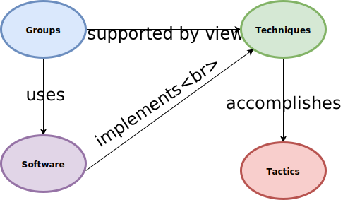

# ADAPT
Active Detection of Advanced Persistent Threats

## Table of Contents:

1. [Team Meeting Notes](/Documentation/team_meeting_notes.md)
2. [Database Docs](/Documentation/db_docs.md)
3. [Windows](Windows/)
4. [MySql Database](db/)
5. [Setup Environment](Setup-Environment/)
6. [Web Console](adapt-frontend/)
7. [Elk](elk/)

## APT Workflow

