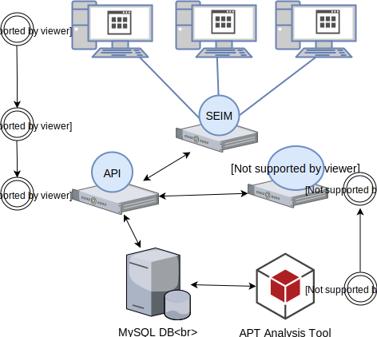

# ADAPT
Active Detection of Advanced Persistent Threats

## System Workflow:

1. [Windows](Windows/) -  Windows 7 machines using Sysmon and Winlogbeat to send log data to the SEIM
2. [Elk](elk/) - ELK server collects log data from the Workstations and forwards logs to the API for our tool
3. [API](db/) - Stores logs for analysis and retrieves them for the frontend webserver
4. [Analysis Engine](db/) - Queries the database and implements our probabilistic model on the log data
5. [Web Console](adapt-frontend/) -  Provides an interface for interacting with results from the analysis engine

Additional info:
- [Database Docs](/Documentation/db_docs.md)
- [Setup Environment](Setup-Environment/)

## APT Workflow

 **Source:** B. E. Strom, A. Applebaum, D. P. Miller, K. C. Nickels, A. G. Pennington, and C. B. Thomas, “MITRE ATT&CK: Design and Philosophy,” MITRE Corporation, 2018.
